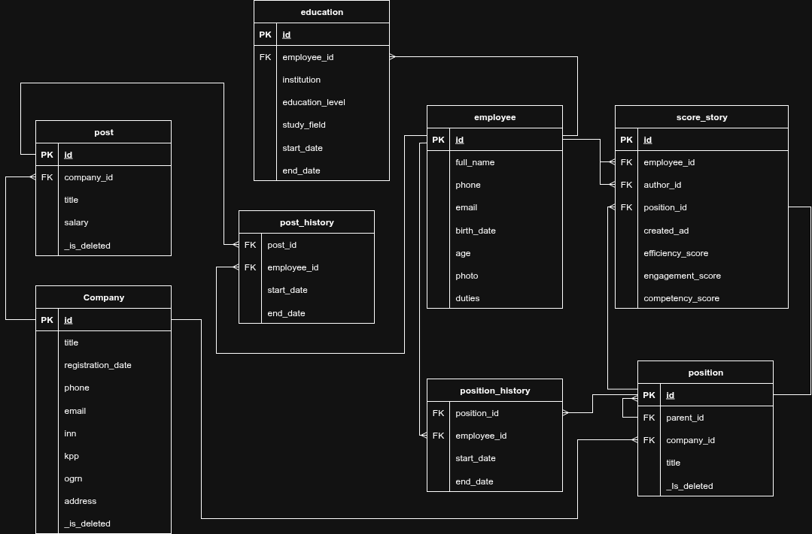

# Приложение для хранения и обработки оценок трудовой эффективности сотрудников группы компаний.

## Цель работы

### Краткое описание

Веб-приложение, позволяющее просматривать данные о сотрудниках и компаниях группы. Данные о сотрудниках
содержат их позицию и должности в различных компаниях группы, ранее выставленные оценки эффективности, сведения об
образовании, персональные данные. Доступ к данным сотрудников предоставляется только вышестоящим сотрудникам, выставлять
оценки может только непосредственный руководитель.
### Анализ аналогичных решений

Краткий анализ существующих решений в данной предметной области представлен в таблице:

| Система    | Оценка эффеткивности | Оценка вовлечености | Оценка компетенций |
|------------|----------------------|---------------------|--------------------|
| Happy Job  | -                    | +                   | -                  |
| Jinn       | -                    | +                   | $\pm$              |
| iSpring    | -                    | +                   | +                  |
| StartExam  | -                    | -                   | $\pm$              |
| Proaction  | -                    | -                   | $\pm$              |
| Redmine    | +                    | -                   | -                  |
| Jira       | +                    | -                   | -                  |
| ToolKeeper | +                    | -                   | -                  |

$\pm$ подразумевает оценку компетенций посредством тестирования, что не всегда достаточно в полной мере.

### Целесообразность и актуальность

Как видно не существует единого сервиса, позволяющего хранить и обрабатывать оценки сотрудников по сформулированным
критериям. При этом существует множество сервисов, позволяющих оценивать отдельные аспекты. Таким образом у компаний
может возникнуть необходимость держать всю информацию, полученную в отдельных сервисах в едином месте, с привязкой к
сотрудникам и их карьерному пути.

## Функциональные требования

Необходимо предоставить следующую функциональность, с соответствующими ограничениями доступа:

* возможность пройти аутентификацию и авторизацию, для получения прав на дальнейший просмотр, изменение, создание сущностей;
* возможность изменения и создания оценок трудовой эффективности для отдельного сотрудника, просмотра оценок трудовой эффективности для отдельного сотрудника или группы сотрудников;
* возможность просмотра, изменения, создания существующих позиций и должностей;
* возможность просмотра текущей истории изменения позиций и должностей для отдельного сотрудника или группы сотрудников, изменения текущей историии изменения позиций и должностей для отдельного сотрудника;
* возможность просмотра, изменения, создания компаний в группе;
* возможность просмотра уровней образования отдельного сотрудника.

## Use-Case-диаграмма

## ER-диаграмма

## Пользовательские сценарии

Возможные сценарии использования системы гостевым пользователем:

* Просмотр информации о компаниях:
    1. зайти на основную страницу сервиса;
    2. перейти к вкладке "Компании".
* Просмотр информации о позициях:
    1. зайти на основную страницу сервиса;
    2. перейти к вкладке "Позиции".
* Авторизоваться:
    1. перейти к вкладке авторизации;
    2. ввести выданные логин и пароль.
Авторизованный гость перестает быть гостем.

Возможные сценарии использования системы сотрудником:

* Выставить оценки непосредственным подчиненным:
    1. перейти к вкладке "Выставить оценки";
    2. подчиненные, с момента выставления последней оценки которым прошел необходимый отрезок времени, вновь доступны
       для оценивания;
    3. выбрать сотрудника для оценки, если список доступных сотрудников не пуст. Иначе, завершение сценария;
    4. Ввести оценки, добавить комментарий, если необходимо.
* Просмотреть информацию о подчиненных или сотрудниках той же позиции:
    1. перейти к вкладке "Сотрудники";
    2. выбрать сотрудника, информацию, о котором необходимо просмотреть.

Сценарий просмотра информации о компаниях, должностях и позициях, не отличается от аналогичных для гостевой роли.

## Формализация бизнес-процессов

### Выставление оценок подчиненным

### Аутентификация гостя

### Просмотр истории оценок

## Описание типа приложения и стек

Бэкенд: C# + .NET

Фронтенд: TS + React 

СУБД: PostgreSQL

## Диаграмма БД

## Верхнеуровневое разбиение на компоненты

# Макеты 

## Экран регистрации

## Экран входа

## Главная страница

.png)

## Страница позиций

### Авторизованного пользователя

.png)

### Неавторизованного пользователя

.png)

## Страница должностей

### Авторизованного пользователя

.png)

### Неавторизованного пользователя

.png)

## Личный кабинет

## Меню навигации

